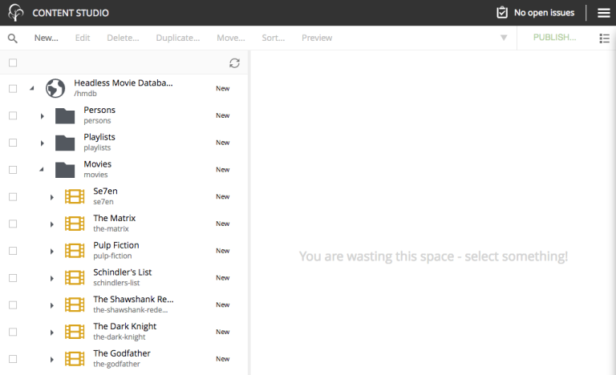

= Gatsby starter for Enonic XP
:toc: right

NOTE: This guide requires Enonic XP 7.0.0 or later

== Introduction

This guide helps you build a site with GatsbyJS based on headless data from Enonic XP served via GraphQL API.
Instructions in this guide assume that you are familiar with Gatsby and Enonic XP frameworks and have basic understanding
of the Headless CMS concept. It will also help if you have some hands-on experience with GraphQL to be able to understand
and write simple queries for fetching data.

Here are some useful links to fill in the blanks:

* https://www.gatsbyjs.org/tutorial/[Gatsby Tutorials,window=_blank]
* https://developer.enonic.com/start/[Get started with Enonic XP,window=_blank]
* https://developer.enonic.com/docs/enonic-cli/master/[Enonic CLI,window=_blank]
* https://developer.enonic.com/templates/headless-cms/[Headless CMS Starter,window=_blank]

== Set up Enonic XP

Before we start building a Gatsby site, we need a data source. In our case data will be stored in Enonic XP and delivered
to the client via GraphQL endpoint.

To set up Enonic XP environment, follow instructions in the
https://developer.enonic.com/templates/headless-cms/[Headless CMS Starter,window=_blank].
You can stop at "Accessing the API" section since this is sufficient to continue with this guide.

NOTE: We assume that you choose suggested name `com.example.myproject` for your project.

image::images/guide-1.png["Project template and name", width="457px"]

Double-check that everything is set up correctly and the project is deployed into a sandbox running at least XP 7.0.0, by
http://localhost:8080/site/default/draft/hmdb/api[clicking here,window=_blank] to make sure that GraphQL endpoint is working fine.

If you see GraphQL playground on your browser page like on the screenshot below then your XP environment is up and running, ready
to deliver headless content.

image::images/guide-2.png["GraphQL playground", width="507px"]

== Set up Gatsby

Follow instructions in https://www.gatsbyjs.org/tutorial/part-zero/["Set Up Your Development Environment",window=_blank] chapter of
the Gatsby tutorial to install prerequisites for Gatsby environment. After that you should have `Node.js`, `Git` an `Gatsby CLI`
installed locally.

WARNING: Pause when you have reached the "_Create a Gatsby site_" section of the Gatsby tutorial and read the tips underneath.

TIP: Gatsby tutorial suggests that you use `gatsby-starter-hello-world` as a starter for your new site. This is fine if
you are learning how to build up a new Gatsby site from scratch, but for our guide we will use a more advanced `gatsby-starter-default`
that adds styling, support for SEO, Web manifest and extendable config which we will need to add the Enonic plugin.

So, when you are ready to create a new Gatsby site, run this command in your terminal:

    gatsby new hello-world https://github.com/gatsbyjs/gatsby-starter-default

TIP: When the site wizard asks you which package manager you would like to use for your new site, select *NPM*

Once you've successfully created your first "Hello World" Gatsby site, you can start Gatsby development server locally
by executing `gatsby develop` in your terminal window.

image::images/guide-3.png["Start Gatsby development server", width="554px"]

After that you will have Gatsby server running on port 8000 while Enonic XP is running on port 8080.

http://localhost:8000/[Click here,window=_blank] to make sure that your Gatsby site is up and running.

image::images/guide-4.png["Gatsby Default Starter", width="1008px"]

Now let's make Gatsby and Enonic XP communicate with each other!

== Headless data

If you have read through the https://developer.enonic.com/templates/headless-cms/[Headless CMS Starter,window=_blank] guide,
you already know that an XP application based on the Headless CMS Starter creates a site called "_Headless Movie Database_", which
contains some sample data about Movies and Persons (actors and directors).

If you have installed Content Studio app in your XP environment, you can see the site there:

=== GraphQL

Before you start using the plugin, it's important that you understand how to fetch data from Enonic XP with GraphQL. The Headless
CMS starter already provides necessary GraphQL schema generation for you, so the only thing you need to do is write correct queries.

NOTE: *New to GraphQL?* Check out the https://graphql.org[GraphQL documentation,window=_blank].

In this guide we will use two prepared queries, one to retrieve _Movies_ and another to retrieve _Persons_. For your own data the queries
will obviously be different, so make sure you get acquainted with GraphQL before building your own Gatsby site.

TIP: You can use GraphQL playground of the http://localhost:8080/site/default/draft/hmdb/api[API endpoint] to write and test queries.

First, let's write a query to retrieve all movies:

image::images/guide-6.png["GraphQL query to retrieve movies", width="929px"]

== Enonic plugin for Gatsby

Enonic plugin for Gatsby provides automatic generation of static pages based on data fetched by GraphQL queries. Data
fetching and page generation happen _build-time_ which means that when user browses the site he's browsing _static_ pages,
with no data being requested at run-time, resulting in extremely fast page load time.

If you have read through the https://developer.enonic.com/templates/headless-cms/[Headless CMS Starter,window=_blank] guide,
you already know that an XP application based on the Headless CMS Starter creates a site called "_Headless Movie Database_", which
contains some sample data about Movies and Persons (actors and directors).

If you have installed Content Studio app in your XP environment, you can see the site there:

In this guide we will configure the Enonic plugin to generate static pages listing all movies and persons, as well as dedicated
page for every movie and person.

=== Install Enonic plugin

You can temporarily stop Gatsby server while we'll be configuring the plugin (note that this will take down the site).

Go to your Gatsby site folder and run the following command in the terminal window:

    npm install gatsby-plugin-enonic

This will download `gatsby-plugin-enonic` from NPM and add dependency to `package.json` file inside the project.

=== Configure Enonic plugin

Open the site project ("_hello-world_") in IDE/code editor of your choice (look for inspiration https://www.gatsbyjs.org/tutorial/part-zero/#set-up-a-code-editor[here,window=_blank] if you are unsure)

.Hello World project structure:
[source,files]
----
HELLO-WORLD
src/
  components/
  images/
  pages/
gatsby-config.js
package-lock.json
package.json
----

Open the file called _gatsby-config.js_ in the project root. Here's where you configure plugins used by the site.

Add this config inside `plugins []`:

    plugins: [
        {
          resolve: `gatsby-plugin-enonic`,
          options: {
            api: 'http://localhost:8080/site/default/draft/hmdb/api', <1>
            refetchInterval: 10, <2>
            application: 'com.example.myproject', <3>
          }
        },
        // other plugins here
    ]

The pages are not configured yet and the plugin is not functional since it requires at least one page definition.
But before we get to page config, let's explain the basic options:

<1> Url of the GraphQL endpoint inside a site in XP. This is where the data will be fetched from.
<2> (optional) If you want content of your pages to be dynamically refreshed whenever underlying data changes, you can specify
how often you want the storage to be checked for new changes (in seconds).
<3> (optional) Name of the application (the one you specify when creating a new project with Enonic CLI)

