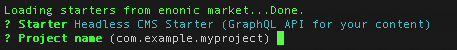
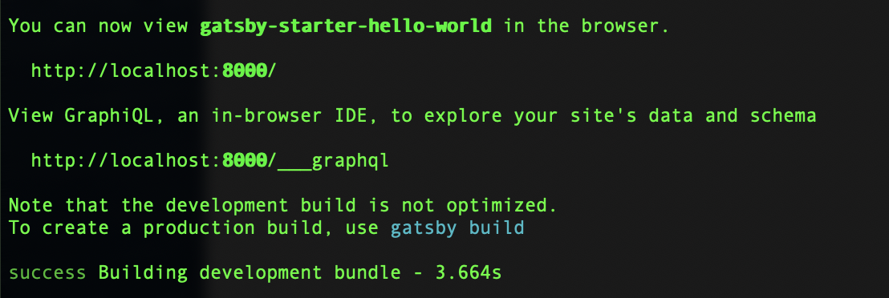

= Gatsby starter for Enonic XP
:toc: right

NOTE: This guide requires Enonic XP 7.2.0 or later

== Introduction

This guide helps you build a site with GatsbyJS based on headless data from Enonic XP served via GraphQL API.
Instructions in this guide assume that you are familiar with Gatsby and Enonic XP frameworks and have basic understanding
of the Headless CMS concept. It will also help if you have some hands-on experience with GraphQL to be able to understand
and write simple queries for fetching data.

Here are some useful links to fill in the blanks:

* https://www.gatsbyjs.org/tutorial/[Gatsby Tutorials]
* https://developer.enonic.com/start/[Get started with Enonic XP]
* https://developer.enonic.com/docs/enonic-cli/master/[Enonic CLI]
* https://developer.enonic.com/templates/headless-cms/[Headless CMS Starter]

== Set up Enonic XP

Before we start building a Gatsby site, we need a data source. In our case data will be stored in Enonic XP and delivered
to the client via GraphQL endpoint.

To set up Enonic XP environment, follow instructions in the
https://developer.enonic.com/templates/headless-cms/[Headless CMS Starter].
You can stop at https://developer.enonic.com/templates/headless-cms#accessing_the_api[Accessing the API] section since this is
sufficient to continue with this guide.

NOTE: We assume that you choose suggested name `com.example.myproject` for your project.

Double-check that everything is set up correctly and the project is deployed into a sandbox running at least XP 7.2.0, by clicking
http://localhost:8080/site/default/draft/hmdb/api[this link] to make sure that GraphQL endpoint is working fine.

If you see GraphQL playground on your browser page like on the screenshot below then your XP environment is up and running, ready
to deliver headless content.

image::images/guide-2.png["GraphQL playground", width="541px"]

== Set up Gatsby

Follow instructions in https://www.gatsbyjs.org/tutorial/part-zero/["Set Up Your Development Environment"] chapter of
the Gatsby tutorial to install prerequisites for Gatsby environment. After that you should have `Node.js`, `Git` an `Gatsby CLI`
installed locally.

WARNING: Pause when you have reached the "_Create a Gatsby site_" section of the Gatsby tutorial and read the tips underneath.

TIP: Gatsby tutorial suggests that you use `gatsby-starter-hello-world` as a starter for your new site. This is fine if
you are learning how to build up a new Gatsby site from scratch, but for our guide we will use a more advanced `gatsby-starter-default`
that adds styling, support for SEO, Web manifest and extendable config which we will need to add the Enonic plugin.

So, when you are ready to create a new Gatsby site, run this command in your terminal:

    gatsby new hello-world https://github.com/gatsbyjs/gatsby-starter-default

TIP: When the site wizard asks you which package manager you would like to use for your new site, select *NPM*

Once you've successfully created your first "Hello World" Gatsby site, you can start Gatsby development server locally
by executing `gatsby develop` in your terminal window.

After that you will have Gatsby server running on port 8000 while Enonic XP is running on port 8080.

http://localhost:8000/[Click here] to make sure that your Gatsby site is up and running.

image::images/guide-4.png["Gatsby Default Starter", width="1390px"]

Now let's make Gatsby and Enonic XP communicate with each other!
