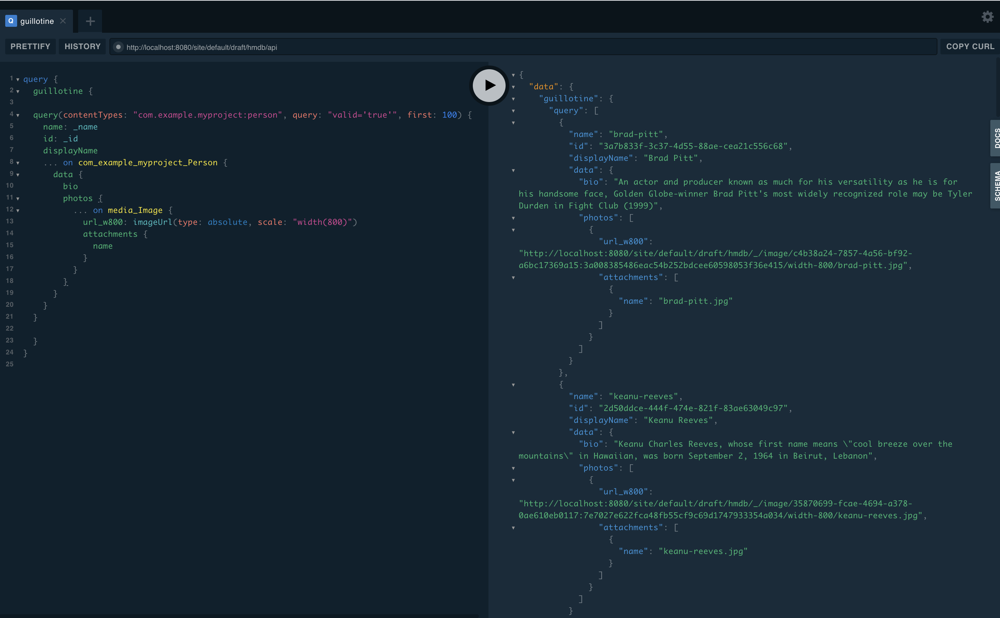
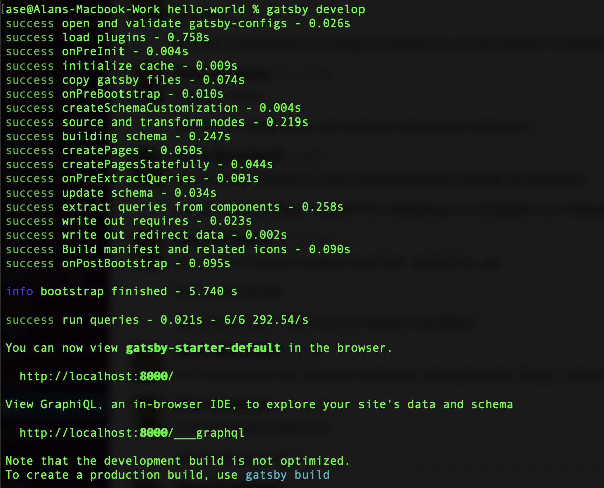
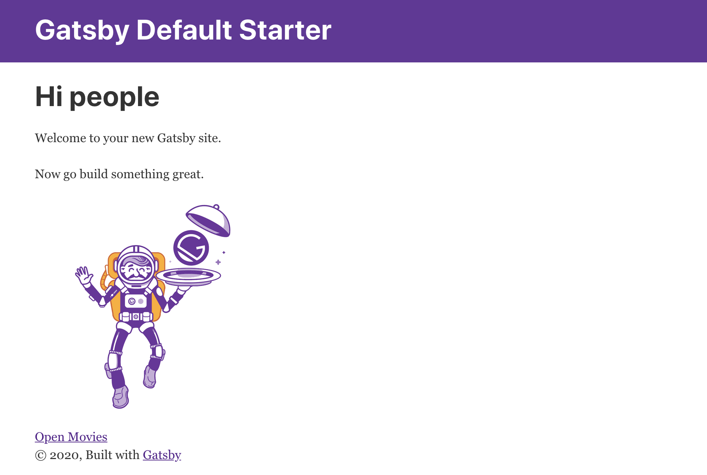
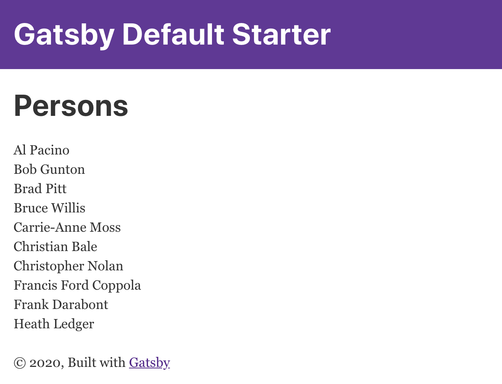
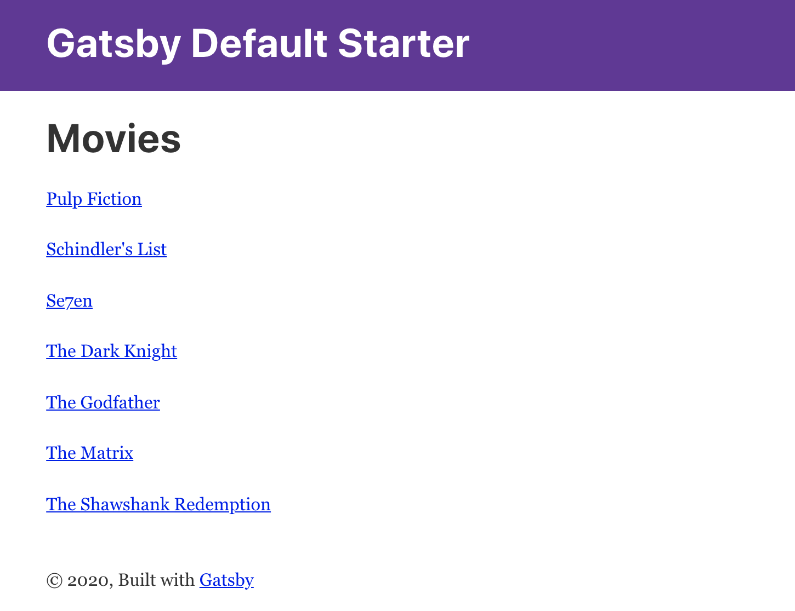
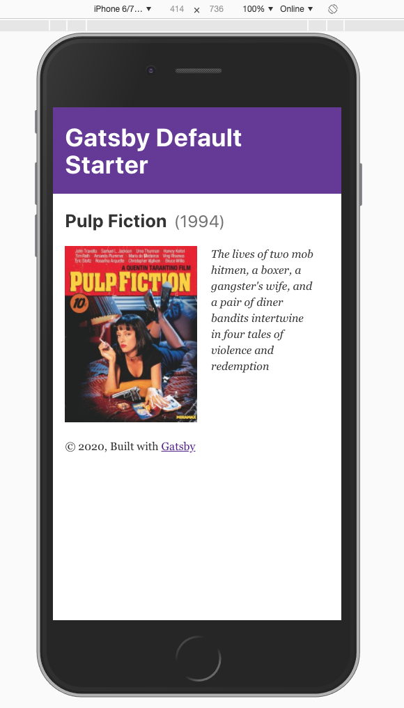
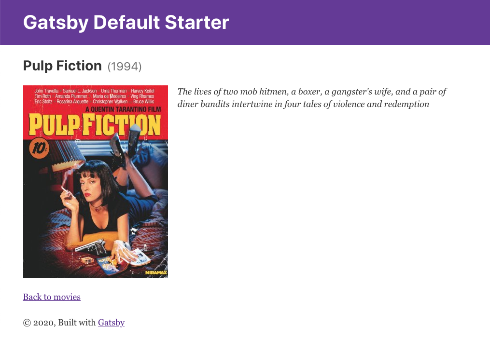
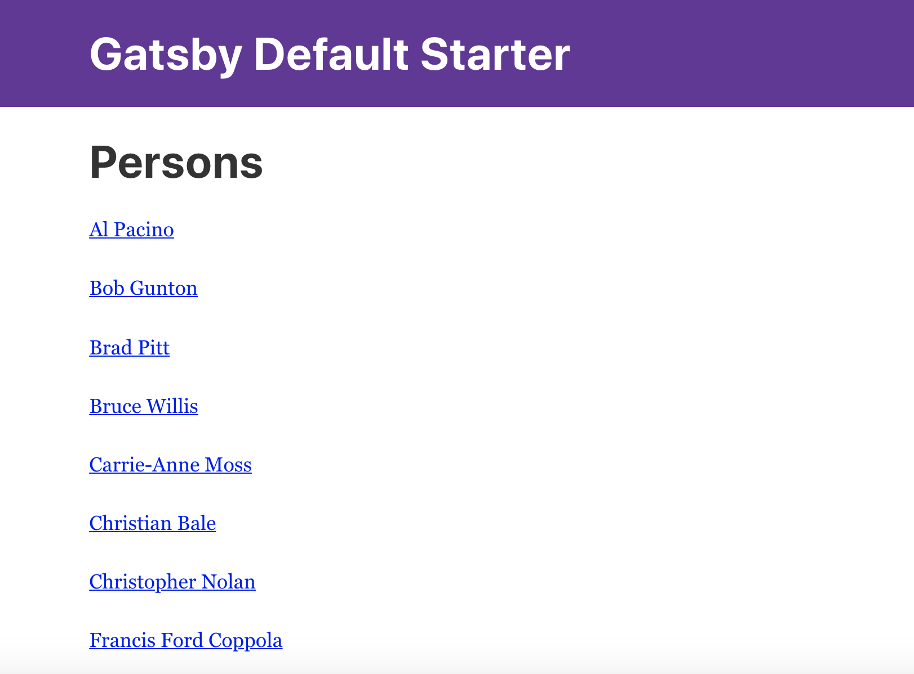
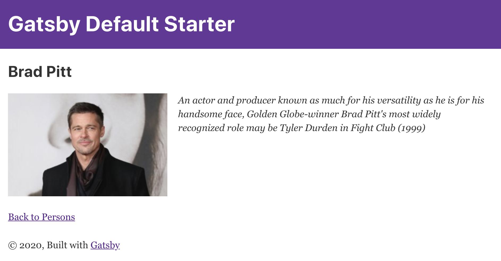

= Generate static websites with Gatsby and Enonic XP
:toc: right
This guide takes you through the basics of building Gatsby sites using data from Enonic XP.

== Introduction
Enonic XP provides a powerful headless graphQL API, and a plugin for the Gatsby.js framework. 

This guide takes you through the steps of integrating the solutions and building your first site based on data from Enonic's "Headless Move Database".

The guide assume that you are familiar with Gatsby.js, Enonic XP and the headless API in particular. 

If not, start with these tutorials before you continue:

* https://www.gatsbyjs.org/tutorial/[Gatsby Tutorials,window=_blank]
* https://developer.enonic.com/templates/headless-cms/[Headless CMS Starter,window=_blank]

== Creating an XP project

Gatsby site are created from various data sources. Throughout this guide we will use Enonic XP to serve data from the Headless API.

Follow instructions in the
https://developer.enonic.com/templates/headless-cms/[Headless CMS Starter] to setup a project with sample data.

NOTE: For simplicity, stick with the standard name `com.example.myproject` when creating your project.

image::images/guide-1.png["Project template and name", width="457px"]

== The Headless Movie Database

The Headless CMS Starter creates a site called
*Headless Movie Database* which contains sample data about Movies and Persons (actors and directors).

Using XP's Content Studio app, the site will look something like this:

image::images/guide-5.png["Headless Movie Database site in Content Studio", width="768px"]

== GraphQL queries

Your API should now be accessible on http://localhost:8080/site/default/draft/hmdb/api

image::images/guide-2.png["GraphQL playground", width="507px"]

Throughout this guide we will use several two prepared queries, one to retrieve _Movies_ and another to retrieve _Persons_.

NOTE: *New to GraphQL?* Check out the https://graphql.org[GraphQL documentation].

=== Fetching movies
First, lets run a simple query that retrieve movies:

.A query to fetch movies:
[source,GraphQL]
----
{
  guillotine {
    query(contentTypes: "com.example.myproject:movie", query: "valid='true'", sort: "displayName") {
      id: _id
      displayName
    }
  }
}
----

image::images/guide-6.png["GraphQL query to retrieve movies", width="929px"]

NOTE: As you already know from the Headless CMS guide, API in the Headless Starter is provided
by the https://developer.enonic.com/docs/guillotine-app[Guillotine project,window=_blank],
therefore each query is wrapped inside `guillotine {}` field.

Note that we pass `contentTypes` parameter to the query to fetch content only of specific type `com.example.myproject:movie`,
where `com.example.myproject` is your application name (the one you chose when creating an XP project with CLI).

The other two parameters of the query are `query: "valid='true'"` (to filter out items that don't have all of the mandatory fields filled out)
and `sort: "displayName"` (to sort the list by name).

This query retrieves the very minimum of fields from the movie content type needed to output the list: `id` and `displayName`.

Note that fields specific to this content type has to be casted with `... on com_example_myproject_Movie` where you again
have to use your application name.

Here's the second query that fetches content of "persons" content type:

=== Feching persons

.A query to fetch persons:
[source,GraphQL]
----
{
  guillotine {
    query(contentTypes: "com.example.myproject:person", query: "valid='true'", sort: "displayName") {
      id: _id
      displayName
    }
  }
}
----

This query is very similar to the first one, except we are requesting content of `com.example.myproject:person` content type.

We will use both these queries when we start configuring the Gatsby plugin, but it's important that you get both
to actually return some data in the GraphQL playground and understand how they work.

== Create a Gatsby project

NOTE: We assume you have already installed the Gatsby developer environment. If not follow instructions in https://www.gatsbyjs.org/tutorial/part-zero/["Set Up Your Development Environment"]. You need at least `Node.js`, `Git` and the `Gatsby CLI`

Create a new project "Static Movie DataBase (SMDB for short)" by running this command in your terminal:

    gatsby new smdb https://github.com/gatsbyjs/gatsby-starter-default

TIP: When the site wizard asks you which package manager you would like to use for your new site, choose `NPM`

The command creates the following project file structure:

.Gatsby movie datbase project structure:
[source,files]
----
SMDB
src/
  components/
  images/
  pages/
gatsby-config.js
package-lock.json
package.json
----

Run the following command to start your local Gatsby development server:

  gatsby develop

You should now have a Gatsby server running on http://localhost:8000/.

image::images/guide-4.png["Gatsby Default Starter", width="1008px"]

Next, its time to make Gatsby and Enonic XP communicate!

== The Enonic Gatsby plugin

Gatsby can fetch content directly from Enonic's GraphQL API, and then programmatically create pages from the content. However, to simplify the process we'll use Enonic's Gatsby plugin instead.

=== Install plugin

Go to your new Gatsby project folder and run the following command in the terminal window:

    npm install gatsby-plugin-enonic

This downloads the `gatsby-plugin-enonic` from NPM and adds a dependency to the `package.json` file inside the project folder.

Once completed, restart the Gatsby server to make sure the plugin is loaded.

=== Configure plugin

Open the file `gatsby-config.js`, it is located in your project root folder. This file is where you configure plugins used by the project.

Add this config inside `plugins []`:

.Base plugin config
[source,JSON]
----
plugins: [
    {
      resolve: `gatsby-plugin-enonic`,
      options: {
        api: 'http://localhost:8080/site/default/draft/hmdb/api', <1>
        application: 'com.example.myproject', <2>
        refetchInterval: 10, <3>
      }
    },
    // other plugins here
]
----

The basic configuration options are:

<1> Specifies URL to the specific site API to use.
<2> (optional) Name of the application in XP that holds the content types. This is the name you specified when crearting the XP project. Can be used as a placeholder in your GraphQL queries later.
<3> (optional) Specify how frequently you want Gatsby to pull XP for new content (in seconds). You don't want this to be too often since a new request will be sent to server every time to fetch the data.

== Creating a listing page

The plugin supports two types of pages: `list` and `details`.

Let's configure pages with Movie and Person lists.

Remember the two GraphQL queries we wrote earlier in this guide to retrieve movies and persons from the database? We need to put them in files
so that the plugin could find them.

. Create a new folder called "_queries_" in the `src` folder of your Gatsby site.

. In `src/queries` create a file called `getMovies.js` exposing the query fetching the movies:
+
.`src/queries/getMovies.js`
[source,javascript]
----
const query = `{
  guillotine {
    query(contentTypes: "com.example.myproject:movie", query: "valid='true'", sort: "displayName") {
      id: _id
      displayName
    }
  }
}
`

module.exports = query;
----

. Now let's do the same for the persons query - put it in a file called `getPersons.js` in the same folder.
+
TIP: You can replace application name inside a query with `%application%` placeholder
(but make sure you defined `application` option in the plugin config). This will help you reuse the same queries in
several applications and not care about possible changes of application name.
+
.`src/queries/getPersons.js` (with placeholder)
[source,javascript]
----
const query = `{
  guillotine {
    query(contentTypes: "%application%:person", query: "valid='true'", sort: "displayName") {
      id: _id
      displayName
    }
  }
}`

module.exports = query;
----
+
TIP: As mentioned before, GraphQL queries for Enonic XP have to be wrapped inside `guillotine {}` field. If you for some
reasons don't like this, you can omit it - the plugin supports both versions.
+
.`src/queries/getPersons.js` (unwrapped)
[source,javascript]
----
const query = `{
  query(contentTypes: "%application%:person", query: "valid='true'", sort: "displayName") {
    id: _id
    displayName
  }
}`

module.exports = query;
----
+

Now that our queries are ready, we need to create a simple template that will output the list retrieved by the queries.
Since we are building a relatively simple list showing just movie or person name (with a link to the details page),
we can use the same template for both lists.

. Create a new folder called "_templates_" in the `src` folder of your Gatsby site.

. In `src/templates` create a file called `list.js` with the following contents:

+
.Template for the listing page
[source,javascript]
----
import React from "react"
import Layout from "../components/layout"
import SEO from "../components/seo"

const ListPage = (args) => {
    const { pageContext } = args
    return (
      <Layout>
        <SEO title={pageContext.title || `List`} />
        <h1>{pageContext.title}</h1>
          {
              pageContext.nodes.map(node => (
                

                    {node.displayName}
                

          ))
          } 
      </Layout>
    )
}

export default ListPage
----
+
Now, from the Gatsby tutorials you know that Gatsby operates with React components. Our listing page (`const ListPage`) is also a React component.
It takes `pageContext` argument which contains the list of `nodes` which are basically the result of a GraphQL
query we wrote a bit earlier in this guide. The component iterates through the array of nodes and for every node it outputs a `
` with unique
key (`node.id`) and an item's display name (`node.displayName`). This makes it a very basic list which can be used both for Movies and Persons.
+
The resulting list is wrapped inside `<Layout>` component which already comes with the Gatsby starter site and which injects header, footer and
applies some nice styling to the page, so that we don't have to care about it.
+
<SEO> is another component that comes with the Gatsby starter which generates various SEO tags. You don't have to use it, but it's a nice add-on.
If you pass `title` argument to it (like we did above) it will use page title in SEO tags and display specified title in the browser tab.

. Go back to `gatsby-config.js` and add the following to our previous plugin config:
+
.Config of the listing page
[source,JSON]
----
pages: [{
  query: require.resolve('./src/queries/getMovies'),  <1>
  list: <2> {
    url: '/movies', <3>
    template: require.resolve('./src/templates/list'), <4>
    title: 'Movies' <5>
  }
}]
----
+
<1> A path to a Javascript file exposing a string with GraphQL query via `module.exports`
<2> A keyword indicating definition of a listing page.
<3> Url of the page. If your site is on "_localhost:8000_", this page will be on "_localhost:8000/movies_"
<4> A path to a Javascript file exposing React component rendering the list of data nodes.
<5> (optional) Title of the page, should you need to use it inside the template
+
.Full config of the plugin (so far)
[source,JSON]
----
{
  resolve: `gatsby-plugin-enonic`,
  options: {
    api: 'http://localhost:8080/site/default/draft/hmdb/api',
    application: 'com.example.myproject',
    refetchInterval: 10,
    pages: [{
      query: require.resolve('./src/queries/getMovies'),
      list: {
        url: '/movies',
        template: require.resolve('./src/templates/list'),
        title: 'Movies'
      }
    }]
  }
}
----

. Now switch to the terminal window and run `gatsby develop` in your `hello-world` folder:
+

+
If everything was configured properly, you will see something similar in the terminal window, indicating that the site is built and
Gatsby development server is ready to serve the content.
+
If you are getting errors, double-check the previous steps to make sure you didn't miss anything, that Enonic XP is up and
running on port 8080 and that syntax inside GraphQL queries and Javascript files is as explained.
+
Open the Gatsby site at http://localhost:8000[http://localhost:8000]. Visually nothing has changed since the first time we opened it after
it was created from the Gatsby starter. So how do we check the contents of our Movies page? You can either open
http://localhost:8000/movies[http://localhost:8000/movies] directly in your browser, or you can add a link to the site's main page to make
your life a bit easier.

. Open `/src/pages/index.js`
+
Modify the "_Go to page 2_" link at the bottom of the page like this:
+
    <Link to="/movies">Open Movies/Link>
+
The page should be refreshed automatically and you will see this:
+

+
Click the http://localhost:8000/movies[Open Movies] link.
+
image::images/guide-10.png["Movies listing", width="393px"]
+
Congratulations! You have built your first Gatsby page with contents from Enonic XP.
+
IMPORTANT: If you make changes to a query, you have to restart the Gatsby development server (press `Ctrl+C` to stop, then `gatsby develop` again)
since the site pages have to be rebuilt from scratch to respect the new query changes.

. Now repeat steps 6-8 to configure a second page that lists persons on `localhost:8000/persons` and link to it from the site's main page.
Don't forget to restart the Gatsby dev server after you've added a config for the Persons page.

.Full config of the plugin (so far)
[source,JSON]
----
{
  resolve: `gatsby-plugin-enonic`,
  options: {
    api: 'http://localhost:8080/site/default/draft/hmdb/api',
    application: 'com.example.myproject',
    refetchInterval: 10,
    pages: [{
      query: require.resolve('./src/queries/getMovies'),
      list: {
        url: '/movies',
        template: require.resolve('./src/templates/list'),
        title: 'Movies'
      }
    },
    {
      query: require.resolve('./src/queries/getPersons'),
      list: {
        url: '/persons',
        template: require.resolve('./src/templates/list'),
        title: 'Persons'
      }
    }]
  }
}
----

You should now have two links on your site's main page:

image::images/guide-11.png["Main page", width="734px"]

Click the http://localhost:8000/persons[Open Persons] link.

TIP: You may notice that there are only 10 items on the Persons page, less than the actual number of items in the database.
That's because of default limitation in GraphQL to make sure you don't overload the server trying to fetch millions of items at once.
You can increase this limit by adding `first: X` parameter to the query:

    query(contentTypes: "%application%:person", query: "valid='true'", sort: "displayName", first: 100)

== Creating a details page

So far we have configured and generated pages that output lists with Movies and Persons, but this is obviously not enough.
We want to be able to click an item in the list and open a dedicated page showing us details for specific movie or person, things like
movie description, release date, person biography, photos etc.

Let's configure our plugin to generate a page for every item retrieved from the storage.

First we need to update our queries. While `id` and `displayName` were enough to generate both lists, on details pages we need much more than that.
For movies we want to show an abstract, release date and a movie image.

Another thing to decide is what url we want our details pages to have. For movies and persons list pages it was simple
(`/movies` and `/persons` is an obvious choice) but for the details pages it makes sense to use movie name and person name in the url.
We cannot use `displayName` since it may contain spaces and other kinds of unsupported characters, so we'll use `name` which is a strictly
validated and sanitized version of `displayName`.

image::images/guide-13.png["Fields from the Movie content type", width="350px"]

. Update the movie query (in `src/queries/getMovie.js`) by adding the new fields to it:
+
[source,GraphQL]
----
  name: _name
  ... on com_example_myproject_Movie {
    data {
      subtitle
      abstract
      photos {
        ... on media_Image {
          imageUrl: imageUrl(type: absolute, scale: "width(300)")
          attachments {
            imageText: name
          }
        }
      }
    }
  }
----
+
TIP: Lines with colons are for aliases - field names that you want to use instead of original names. For example,
if you want to use `name` instead of original `_name` then you do `name: _name`
+
.Full Movies query (`src/queries/getMovie.js`)
[source,javascript]
----
const query = `{
  guillotine {
    query(contentTypes: "com.example.myproject:movie", query: "valid='true'", sort: "displayName") {
      id: _id
      displayName
      name: _name
      ... on com_example_myproject_Movie {
        data {
          subtitle
          abstract
          photos {
            ... on media_Image {
              imageUrl: imageUrl(type: absolute, scale: "width(300)")
              attachments {
                imageText: name
              }
            }
          }
        }
      }
    }
  }
}
`

module.exports = query;
----
+
NOTE: Fields that are specific for the `com.example.myproject:movie` content type have to be cast with `... on com_example_myproject_Movie`.
Here you can also use `%application%` placeholder just like in content types: `... on %application%_Movie`

. Now we need a template for the movie details page. Create a new file called `movie.js` in the `templates` folder
(where template of the list page is) with the following contents:
+
.`src/templates/movie.js`
[source,javascript]
----
import React from "react"
import Layout from "../components/layout"
import SEO from "../components/seo"

const getPageTitle = (pageContext) => {
  const node = pageContext.node;

  if (!!node && pageContext.title && (node[pageContext.title] || node.data[pageContext.title])) {
    return node[pageContext.title] || node.data[pageContext.title];
  }

  return pageContext.title || 'Person';
};

const MoviePage = (args) => {
    const { pageContext } = args;
    const movie = pageContext.node;
    const movieMeta = movie.data;

    return (
      <Layout>
        <SEO title={getPageTitle(pageContext)} />
        

          

            <h2>{movie.displayName}
            {movieMeta.release && (
              <i style={{
                fontStyle: 'normal',
                fontWeight: 'normal',
                fontSize: '24px',
                marginLeft: '10px',
                opacity: '0.7'
              }}>({new Date(movieMeta.release).getFullYear()})</i>
            )}
            </h2>
          

          

            
            
<i>{movieMeta.abstract}</i>

          

        

      </Layout>
    )
}

export default MoviePage

----
+
A very simple layout: movie's display name in the header, then a `
` element with movie image and abstract side by side. We'll also
use movie's short description as tooltip on the image, and attachment's name as image's alt text. This is of course just an example - feel
free to build a layout of your choice using the field of your GraphQL query.

. Now let's configure the movie details page inside the plugin configuration (in `gatsby-config.js`).
Add this inside the config of the movies page, right after `list {}`:
+
.Config of the movie details page
[source,JSON]
----
  details: {   <1>
    url: '/movie',  <2>
    template: require.resolve('./src/templates/movie'),  <3>
    key: 'name',  <4>
    title: 'displayName'   <5>
  }
----
+
<1> A keyword indicating definition of a details page.
<2> (optional) Base url of the details page. If your site is on "_localhost:8000_", this page will be on
"_localhost:8000/*movie*/{key}_" (see below). If omitted, value from `pages.list.url` will be used.
<3> A path to a Javascript file exposing React component rendering fields of the data node.
<4> A field in the query whose value will be added to the details page url
<5> (optional) Title of the page, should you need to use it inside the template
+
.Full config of the plugin (so far)
[source,JSON]
----
{
  resolve: `gatsby-plugin-enonic`,
  options: {
    api: 'http://localhost:8080/site/default/draft/hmdb/api',
    application: 'com.example.myproject',
    refetchInterval: 10,
    pages: [{
      query: require.resolve('./src/queries/getMovies'),
      list: {
        url: '/movies',
        template: require.resolve('./src/templates/list'),
        title: 'Movies'
      },
      details: {
        url: '/movie',
        template: require.resolve('./src/templates/movie'),
        key: 'name',
        title: 'displayName'
      }
    },
    {
      query: require.resolve('./src/queries/getPersons'),
      list: {
        url: '/persons',
        template: require.resolve('./src/templates/list'),
        title: 'Persons'
      }
    }]
  }
}
----

. Stop the Gatsby server (if it's running) and start again by executing `gatsby develop` in your terminal window.
If everything was configured correctly, there will be no errors and your Gatsby site will be up and running on the same port.
However, even though individual pages for each movie are (hopefully) generated, we don't see them.
What we need is to add links from the movie list page to respective details page of each movie.

. Open the list page template (`/src/templates/list.js`) and import native Gatsby's `Link` component:

    import {Link} from "gatsby";

. In the same file, replace `` element containing displaying data node name with more complicated condition
which will render a link if details page is configured and the same old  with no link otherwise.
+
.Render link to the movie details page
[source,Javascript]
----
    

        {pageContext.detailsPageUrl &&
            

                <Link to={`${pageContext.detailsPageUrl}/${node[pageContext.detailsPageKey]}`}>
                    {node.displayName}
                </Link>
            

        }
        {!pageContext.detailsPageUrl && {node.displayName}}
    

----
+
As you can see, in `to` parameter of the `<Link>` component we pass combination of details page url
(`pages.details.url` from the config) and _value_ of the field specified as a key (`pages.details.key`), which
in our case will be something like "_/movie/pulp-fiction_". The `
` element with `<Link>` component inside will
only be rendered if `detailsPageUrl` exists in page context, which only happens when details page is configured.
If not, a simple `` with node's `displayName` will be shown. This way we can still use the same template both for Movies
and Persons even though we have only configured details page for Movies.

. The list page should refresh automatically (if not - restart the Gatsby server again) and you will see that the movie list
has now turned into a list of links.
+

+
Click any link in the list to open our new movie details page:
+
image::images/guide-15.png["Movie details page", width="545px"]
+
Simple but pretty good looking, huh? It's fully responsive, too:
+

+
One thing we're missing on this page is being able to quickly return back to the list of movies. Our plugin gives you
this out of the box - a link to the list page will automatically be available in the `pageContext` object of a details page.

. Modify the Movie details template ((`/src/templates/movie.js`) by importing the `Link` component:

    import {Link} from "gatsby"

. Add a link to the bottom of the details page, right before closing `</Layout>` tag:
+
.`src/templates/movie.js`
[source,javascript]
----
  import {Link} from "gatsby"
  ...
  

  

    <Link to={`${pageContext.listPageUrl}`}>Back to Movies</Link>
  

</Layout>
----
+

+
Now there's "_Back to Movies_" link on every details page which we can click to go back to the list.
+
The person list page still looks the same though, since we haven't yet configured details page for it.
+
Let's do that now. We will use the same principle as with the movies - we'll use `name` field as a key for the details page url
(so that url looks like `/person/<name>`) and show full person's name, short biography and a photo on the details page

. Modify the Persons query (`src/queries/getPersons.js`) by adding the new fields to it:
+
[source,GraphQL]
----
name: _name
... on %application%_Person {
  data {
    bio
    photos {
      ... on media_Image {
        imageUrl: imageUrl(type: absolute, scale: "width(300)")
        attachments {
          altName: name
        }
      }
    }
  }
}
----
+
.Full Persons query (`src/queries/getPersons.js`)
[source,javascript]
----
const query = `{
  query(contentTypes: "%application%:person", query: "valid='true'", sort: "displayName", first: 100) {
    id: _id
    displayName
    name: _name
    ... on %application%_Person {
      data {
        bio
        photos {
          ... on media_Image {
            imageUrl: imageUrl(type: absolute, scale: "width(300)")
            attachments {
              altName: name
            }
          }
        }
      }
    }
  }
}`

module.exports = query;
----

. Create a template called `person.js` in the `templates` folder with the following contents:
+
.`src/templates/person.js`
[source,javascript]
----
import React from "react"
import Layout from "../components/layout"
import SEO from "../components/seo"
import {Link} from "gatsby";

const getPageTitle = (pageContext) => {
  const node = pageContext.node;

  if (!!node && pageContext.title && (node[pageContext.title] || node.data[pageContext.title])) {
    return node[pageContext.title] || node.data[pageContext.title];
  }

  return pageContext.title || 'Person';
};

const PersonPage = (args) => {
  const { pageContext } = args;
  const person = pageContext.node;
  const personMeta = person.data;

    return (
      <Layout>
        <SEO title={getPageTitle(pageContext)} />
        

          

            <h2>{person.displayName}</h2>
          

          

            
            
<i>{personMeta.bio}</i>

          

        

        

          <Link to={`${pageContext.listPageUrl}`}>Back to Persons</Link>
        

      </Layout>
    )
}

export default PersonPage

----
+
TIP: You can move `getPageTitle()` method to a separate helper class since it's exactly the same as the one in the Movie details page.

. Modify plugin config (`gatsby-config.js`) by adding configuration of the person's details page:
+
.Config of the person details page
[source,JSON]
----
  details: {
    url: '/person',
    template: require.resolve('./src/templates/person'),
    key: 'name',
    title: 'displayName'
  }
----
+
.Full config of the plugin
[source,JSON]
----
{
  resolve: `gatsby-plugin-enonic`,
  options: {
    api: 'http://localhost:8080/site/default/draft/hmdb/api',
    application: 'com.example.myproject',
    refetchInterval: 10,
    pages: [{
      query: require.resolve('./src/queries/getMovies'),
      list: {
        url: '/movies',
        template: require.resolve('./src/templates/list'),
        title: 'Movies'
      },
      details: {
        url: '/movie',
        template: require.resolve('./src/templates/movie'),
        key: 'name',
        title: 'displayName'
      }
    },
    {
      query: require.resolve('./src/queries/getPersons'),
      list: {
        url: '/persons',
        template: require.resolve('./src/templates/list'),
        title: 'Persons'
      },
      details: {
        url: '/person',
        template: require.resolve('./src/templates/person'),
        key: 'name',
        title: 'displayName'
      }
    }]
  }
}
----

. Restart the Gatsby starter and check out the new pages:
+

+

+

== Cross-references between the pages

Let's do some funny stuff now and enliven our movie page a little. Let's display cast for each movie on the movie details page - a character name,
actor playing the role and actor's photo, and add a link to the actor's details page.

. First we need to expand our query fetching the list of movies to contain details of the movie's cast.
+
Add this right after the `photos {}` section of the movie query:
+
[source,GraphQL]
----
  cast {
    character
    actor {
      name: _name
      displayName
      ... on com_example_myproject_Person {
        data {
          photos {
            ... on media_Image {
              actorUmageUrl: imageUrl(type: absolute, scale: "width(300)")
            }
          }
        }
      }
    }
  }
----
+
NOTE: Why do we need both `name` and `displayName` fields? `displayName` is an original, "human-readable" actor's name, and `name` is
something that we used to generate details page for persons so we need to use the same field to build a link to the actor's details page.
+
.Full Movies query (`src/queries/getMovie.js`)
[source,javascript]
----
const query = `{
    query(contentTypes: "%application%:movie", query: "valid='true'", sort: "displayName") {
      id: _id
      displayName
      name: _name
      ... on %application%_Movie {
        data {
          subtitle
          abstract
          photos {
            ... on media_Image {
              imageUrl: imageUrl(type: absolute, scale: "width(300)")
              attachments {
                imageText: name
              }
            }
          }
          cast {
            character
            actor {
              name: _name
              displayName
              ... on com_example_myproject_Person {
                data {
                  photos {
                    ... on media_Image {
                      imageUrl: imageUrl(type: absolute, scale: "width(50)")
                    }
                  }
                }
              }
            }
          }
        }
      }
    }
}
`

module.exports = query;
----
+
TIP: Use http://localhost:8080/site/default/draft/hmdb/api[GraphQL playground] or install https://market.enonic.com/vendors/enonic/graphiql[GraphiQL] admin tool from Enonic Market to test results of your queries.

. Now modify the movie details template (`/src/templates/movie.js`) to add info about cast to the page.
Replace `
` element with movie abstract to the right of the image
+
    
<i>{movieMeta.abstract}</i>

+
with more complex container displaying both the abstract and cast details underneath:
+
[source,HTML]
----

  
<i>{movieMeta.abstract}</i>

  {movieMeta.cast && (
    <>
      <h4>Cast</h4>
      

        {
          movieMeta.cast.map(cast => (
            

              
                

                  <i
                    style={{
                      fontSize: '14px'
                  }}>{cast.character}</i>
                  <Link to={`person/${cast.actor.name}`}>
                      {cast.actor.displayName}
                  </Link>
                

            

          ))
        }
      

    </>
  )}

----
+
.Full Movie template (`src/templates/movie.js`)
[source,javascript]
----
import React from "react"
import Layout from "../components/layout"
import SEO from "../components/seo"
import {Link} from "gatsby"

const getPageTitle = (pageContext) => {
  const node = pageContext.node;

  if (!!node && pageContext.title && (node[pageContext.title] || node.data[pageContext.title])) {
    return node[pageContext.title] || node.data[pageContext.title];
  }

  return pageContext.title || 'Person';
};

const MoviePage = (args) => {
    const { pageContext } = args;
    const movie = pageContext.node;
    const movieMeta = movie.data;

    return (
      <Layout>
        <SEO title={getPageTitle(pageContext)} />
        

          

            <h2>{movie.displayName}
            {movieMeta.release && (
              <i style={{
                fontStyle: 'normal',
                fontWeight: 'normal',
                fontSize: '24px',
                marginLeft: '10px',
                opacity: '0.7'
              }}>({new Date(movieMeta.release).getFullYear()})</i>
            )}
            </h2>
          

          

            
            

              
<i>{movieMeta.abstract}</i>

              {movieMeta.cast && (
                <>
                  <h4>Cast</h4>
                  

                    {
                      movieMeta.cast.map(cast => (
                        

                          
                            

                              <i
                                style={{
                                  fontSize: '14px'
                              }}>{cast.character}</i>
                              <Link to={`person/${cast.actor.name}`}>
                                  {cast.actor.displayName}
                              </Link>
                            

                        

                      ))
                    }
                  

                </>
              )}
            

          

        

        

          <Link to={`${pageContext.listPageUrl}`}>Back to Movies</Link>
        

      </Layout>
    )
}

export default MoviePage

----

. Now restart the Gatsby dev server, open any movie page and embrace the beauty of your creation:
+
image::images/guide-20.png["Movie details page", width="503px"]

Congratulations! You have built a simple Gatsby site rendering static pages with data fetched from Enonic XP.

== For the impatient

TIP: You can find the fully-functional Gatsby starter implementing all of the described tips and tricks in this
https://github.com/enonic/guide-gatsby-starter[Github repo]. To launch it locally, set up your XP environment, create a project
based on the Headless Starter as described in the beginning of this guide, and then run this in your terminal:

    git clone git@github.com:enonic/guide-gatsby-starter.git
    cd guide-gatsby-starter
    gatsby develop
